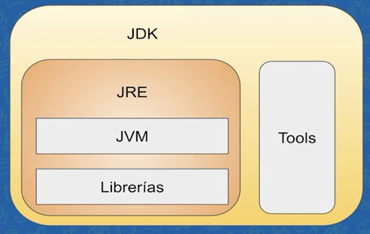

# Java JRE y JDK: compile y ejecute su primer programa

- ## ¿Que es Java?

    Java es un lenguaje de programación OOP Quizás algunas de las características de Java que en este caso pues es un lenguaje orientado a objetos, es un lenguaje  fácil de entender, es multiplataforma, quizás algunos otros lenguajes de programación ya tienen este feature o estos     features, pero la ventaja de Java no es el lenguaje en sí. La principal ventaja de Java es la plataforma.

    La plataforma Java básicamente sería la máquina virtual de Java que es lo principal, los distintos frameworks que tenemos, las distintas librerías de la comunidad open source totalmente gratuitas que tenemos para el uso y la facilidad  para implementar todo ello.

- ## Principales caracteristicas de Java

    Entre las principales características que tenemos de la plataforma Java es portable, porque puede ser cargada en    cualquier dispositivo, es fácil de implementar, es segura y es omnipresente. Algunos ejemplos que tenemos para describir   mejor estas características son: encontramos Java en servidores, la máquina virtual de Java está presente en servidores   de bancos, empresas grandes, enormes, justo por las características que tiene. Está presente en dispositivos móviles,     teléfonos, tablets, hay una infinidad de dispositivos que corren Java, disponible también en computadores como el mío   actualmente, como el de ustedes también. Hoy en día ya básicamente es imposible tener un computador sin Java porque de    hecho muchas de las aplicaciones actuales necesitan la máquina virtual de Java para ejecutarse.

    **-¿Cuál es el mayor beneficio de la máquina virtual de Java (JVM)?**

    R: El mayor beneficio de Java es que es multiplataforma

    **-Versiones de Java**

    

    Para entender un poco cómo es que funciona el ecosistema de Java. Tenemos la máquina virtual de Java, la Java Virtual   Machine, pero no es lo único que necesitamos para escribir código de Java.De hecho tenemos otros features, como las   librerías escritas en Java que nos van a dar diversas funcionalidades, y este conjunto nos va a dar el JRE, que es el     Java Runtime Environment. El Java Runtime Envrionment es la Java Virtual Machine con el conjunto de librerías nos van a permitir ejecutar código Java en nuestra máquina.

    

- **Estructura de compilado de Java**
    
    la estructura de compilado de java es asi

        class Programa {
        public static void main(String[] args){
            System.out.println("¿Puedes ayudar a Ana?");
            }
        }

        Class= Es la palabra reservada de java para iniciar codigo
        public= Es la entrada de ejecutar codigo
        static= es el estado en el que esta 
        void =
        String[] args=

## Como compilar y ejecutar codigo
    
    Primero se crea un archivo .java que debe contener en su interior una class del programa que se escribe asi:

        class Programa {
        public static void main(String[] args) {
            System.out.println("Funcionooo!!!");
        }
        }
    
        // Despues de que tengamos el programa hecho guardamos y ejecutamos el nombre del programa .java con javac
    
        *javac Programa.java*
    
        // Despues se nos creara un archivo javac Y para llamar a la JVM usamos solo el nombre de la clase (sin     extensión)
    
        *java Programa*

 ## Date cuenta de que podemos usar operadores aritméticos:
    + para Sumar
    - para Restar
    * para Multiplicación
    / para División

## Tipos de variables en Java

Las varibales deben estar inicializadas sino Java no nos dejara copilar Tambien para llamar una variable solo se nesececita el nombre de la misma para ser llamada

    int Ejemplo = 28; //int es una palabra reservada de Java para guardar numeros de tipo entero como se ve

    double Ejemplo = 24.32 //double guarda caracteres no decimameles 

    long Ejemplo = 12222L //Es un tipo de variable que guarda una cantidad grande caracteres de 1 al 64 bits y termina con una L

    short Ejemplo = 1 // Es un tipo de variable que guarda datos pequeños

    byte Ejemplo = 0.1 // Metodo para guardar numeros mas pequeños

    float Ejemplo = 1F // numero decimal pequeño este al final tiene una f

    char Ejemplo = 'a' // Es un tipo de dato unico que guarda caracteres en '' tambien puede guardar numeros

    String Ejemplo = "Hola" //es tipo de variable que guarda cualquier dato y es una palabra reservada

- ## Convesorsiones 

Para convertir el dato de una variable a otra se tiene que hacer un Cast 
    **Ejemplo**

    class Programa {
        public static void main(String[] args) {
            double variable1 = 230.3232;
            int variableEntero = (int) variable1; En este momento se hace el cast osea la conversion 
            System.out.println("Funcionooo!!!");
        }
    }

- ## Condicionales 
Entonces, en el caso de condicionales, lo que buscamos aquí es hacer una pequeña comparación, una evaluación de una condición, y si la condición es verdadera haz una cosa, y si es falsa, haz otra o simplemente no hagas nada.
La palabra reserva de Java es el **if** en la estructura de if nosotrosos declaramos la evaluacion dentro del (), esto es obligatorio en Java y cuando pase nuestra validacion ponemos dentro de {} lo que queremos que haga.
**Ejemplo**

    int edad = 17 //valor de edad 

    if(edad >= 18){     //Validacion si edad es mayor o igual 
        System.out.println("Uste puede pasar");  //Si edad es mayor se imprime el mensaje de Uste puede pasar
    }else{      //Si la validacion no pasa esta pasara al else que no paso 
        System.out.println("Uste no puede pasar");      //Sino es mayor entonces se imprime este mensaje Uste no puede pasar
    }

- ## Bolean 
Boolean es una palabra reserva de JAVA, que es tipo de variable primitivo que solo guarda 2 condiciones tipo *True* o *false* que son para validar datos si cumplen un tipo condicion 
    **Ejemplo**

    int edad = 17 //valor de edad 
    boolean esPareja = true //valor booleano que puede ser true o false

    if(edad >= 18 && esPareja){     //Validacion si es pareja es igual a true
        System.out.println("Uste puede pasar");  //Si edad es mayor se imprime el mensaje de Uste puede pasar
    }else{      //Si la validacion no pasa esta pasara al else que no paso 
        System.out.println("Uste no puede pasar");      //Sino es mayor entonces se imprime este mensaje Uste no puede pasar
    }

    **Ejemplo2**
    Para hacer el codigo mas optimo con boolean se puede hacer de la siguiente forma
    
    int edad = 17; //valor de edad 
    int cantidadPersonas = 2; //cantidad de personas 
    boolean esPareja = cantidadPersonas > 1 //validacion si es mayor a 1 entonces es true
    boolean PuedePasar = edad >= 18 && esPareja; //Valida si es = o mayor a 18 y tambien valida si es pareja lo que hace este valor es lo que hace adentro del parentecis del if 

    if(PuedePasar){     //variable de que si puede pasar
        System.out.println("Uste puede pasar");  //Si edad es mayor se imprime el mensaje de Uste puede pasar
    }else{      //Si la validacion no pasa esta pasara al else que no paso 
        System.out.println("Uste no puede pasar");      //Sino es mayor entonces se imprime este mensaje Uste no puede pasar
    }
- ## Operadores logicos
    Los operadores de validacion se usan dentro de las condiciones de *if* que estos se pueden ver representados de distintas formas 

    AND está representado por los caracteres &&

    OR está representado por los caracteres ||
     
     
    AND es para decir y este operador requerido mientras que o es una validacion opcional como o puede pasar esto

- ## Scope e inicializacion

    El scope es el alcanze de la variables dentro de las {} si una variable adentro de estas {} llama a una que este afuera el rango del scope no le va a permitir ser inicializada

 

- **Ciclo While**

Se ejecutan de manera consecutiva mientras una condicion sea verdadera, esto lo que hace es una tarea repetitiva para esto se usa la palabra reservada de *While* El while siempre necesitará una expresión condicional que definirá cuándo se debe romper el ciclo.

    *Ejemplo*
    int contator = 0; //Variable de contador

    while (contador <= 10  ){ //mientras que (condicion) ahi la condicion es que mientras contador sea menor que 10 se ejecute
        //Ejecute esto
        System.out.println(contador);
        contador = contador + 1; //Aqui lo que se hace es la suma a la variable contador
        contador += 1; es la especificacion de lo que se quiere sumar 
        contador++; Esto es para sumar uno a la variable con ++
    }

- **Ciclo For**

For es una palabra reservada que ahira lo mismo que while pero de otra manera la sintaxis es asi con los parametros del ciclo dentro de la () que primero se ejecuta la variable despues sigue la condicion y por ultimo la ejecucion de lo que queremos que haga

    *Ejemplo*
    //  Variable        condicion       Ejecucion
    for (int contador=0; contador <=10; contador++){
        System.out.println(contador);
        }
    for tiene sentido usarlo en el momento que usemos una variable interna

- **Ciclos o bucles anidados**

Los ciclos se pueden meter dentro de si para asi conseguir un ciclo aninado que puede imprimir el resultado que quiera

    for (int contador=0; contador <=10; contador++){
        for (int multiplicador=0; multiplicador <=10; multiplicador++){
            System.out.println(contador * multiplicador);
            System.out.println(" ");
        }
        System.out.println();
    }

- **Ciclos break**

Esta palabra reservada se suele usar para romper los ciclos para esto se le suele poner dentro de un if si cumple esa condicion que ese ejcuta break para romper el ciclo por esa condicion Para la ejecución del bucle más interno que contiene el comando break y continúa ejecutando los bucles más externos