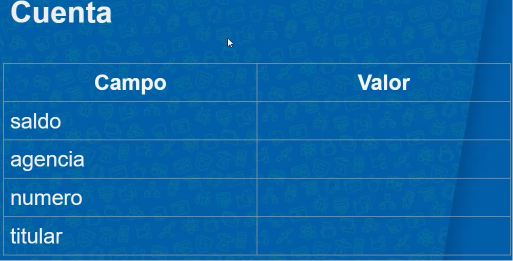
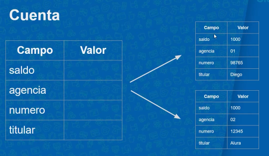
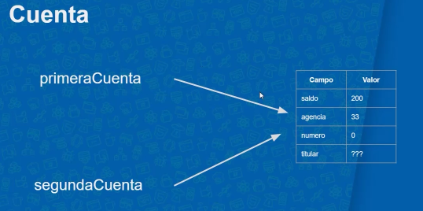
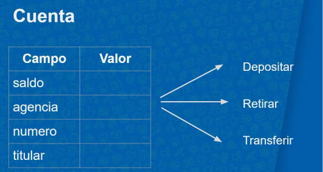

# Java OO: Entendiendo la Orientación a Objetos

## Temas del cusro 
- Domine el paradigma de programación más usado en el mercado.
- Entienda lo que son referencias y objetos
- Use atributos, métodos de la instancia y de la clase
- Aprenda a definir objetos a través de constructores
- Aprenda sobre encapsulamiento
 
## Introducin
En este curso se trabaja la orientacion a objectos en donde entederemos el conceptos de librerias y que son los objectos en Java la idea central del paradigma de Orientación de objetos es de que Los datos y la funcionalidad de una entidad van de la mano.
 

## Definicion de un objecto

Un objecto es la representacion del conjunto de atributos que compone alguna entidad o cosa de la vida que se intenta plasmar en la programacion. para hacer esto en el curso se hara un proyecto el cual es la creacion de un banco que este va a tener objectos en donde definiremos las caracteristicas que va tener la cuenta 

## Crear una clase

Primero debemos crear una clase con la palabra reservada de Clas la cual va ser la entidad que va guardar los valores de cuenta como se puede ver el ejemplo:

    //entidad cuenta:
    class Cuenta {

        double saldo; 
        int agencia;
        int numero;
        String titular;
    }   

Para crear una instancia, es obligatorio completar los valores de todos los atributos.

## Instancias

Una instacia es la representacion de un objecto siendo en si un objecto en particular que tiene su propia informacion y es unica, para creacion de una instacia se hace de la siguiente forma:

    public static void main(String[] args) { 
        Cuenta primeraCuenta =  new Cuenta(); //Antes de llamar a la cuenta toca especificar que tipo de variable es en este caso la variable es de tipo cuenta
        primeraCuenta.saldo = 1000; //llamamos el objecto y con el . determinamos el campo que va trabajar y le asignamos un saldo de 1000
        System.out.println(primeraCuenta.saldo); //para ver que si se guardo escribomos el objecto junto al campo
    }

    new //Es una palabra reservada lo que hace es decir crea esto nuevo en este caso la instacia Cuenta con (), tambien lo que hace es crear un espacio reservado en la memoria de java

**Valores por default**

Los valores por default en los objectos son los valores que tienen por defecto los campo de un objecto casi siempre es 0 o null tambien se da este valor porque llamamos a la instacia de un objecto y este inicializa los campos, tambien podemos determinar el valor por defecto como se puede ver:

    class Cuenta {

    double saldo = 100; 
    int agencia = 1;
    int numero = 02;
    String titular = "yo";

    }

**Referencias**

La referencia es el lugar de la memoria donde se guarda el objecto los datos de un obejcto si 2 objectos tienen la misma referencia del lugar de memoria tanto el primer objecto afectaran al otro y viseversa con la misma refencia osea cuando apunta al mismo objecto estas se suman los valores

        public static void main(String[] args) {
        Cuenta primeraCuenta = new Cuenta();
        primeraCuenta.saldo = 300;

        System.out.println("saldo de primera cuenta : " + primeraCuenta.saldo);

        Cuenta segundaCuenta = primeraCuenta;

        System.out.println("saldo de segunda Cuenta: " + segundaCuenta.saldo);

        segundaCuenta.saldo += 100;
        System.out.println("saldo de segunda Cuenta " + segundaCuenta.saldo);

        System.out.println(primeraCuenta.saldo);

        if(primeraCuenta == segundaCuenta) {
            System.out.println("Es la misma cuenta");
        }else{
            System.out.println("Es diferente");
        }

        System.out.println(primeraCuenta);
        System.out.println(segundaCuenta);
        }
    

## Creacion metodo sin retorno

Un metodo es un corportamiento que queramos que tenga nuestro objecto y esos los paso que debe tener nuestro objecto un metodo para que funcione nesecita parametros que el inpot que hara debtro de ()

    class Cuenta {

    double saldo; 
    int agencia;
    int numero;
    String titular;
    void depositar (double valor){
        saldo = saldo + valor;
    } //Este el ejempplo de un metodo que no regrese valor 
    }

void //Es una palabra reservada para decir que algo no retorne valor puede ejecutarse sin que retorne algo 

[Pruebas metodos](./src/PruebasMetodos.java) 

- **¿Cuál es la sintaxis y el orden correctos para llamar a un método con Java?**

    nombreDeReferencia.nombreDelMetodo();

- **Uso de this**
Usar la palabra reservada de this forma parte de buenas practicas lo que hace es decir que hace referencia a este objecto 

    class Cuenta {
    double saldo; 
    int agencia;
    int numero;
    String titular;
    void depositar (double valor){
        // Esta cuenta           // Esta cuenta
        //this account           //this account 
        //this object            //this object
        this.saldo             =      this.saldo                + valor;
        }    
    }

## Creacion metodo con retorno

Un metodo con retorno de valor hace lo opuesto a uno que no retorne este si nesecita una validacion para que este aprobado sino no se pasara la validacion como se mira 

    //No retorna valor 
    public void depositar (double valor){
        saldo = saldo + valor;
    }

    //Retornar valor 
    public boolean retirar(double valor) { //el tipo es booleano para la validacion 
        if(this.saldo >= saldo){
            this.saldo = this.saldo - valor; //la validacion del retiro 
            return true; //si pasa la validacion pasa true lo cual la finaliza
        } else{
            return false; //si no entonces no pasa 
        }
        
    }

## Referenciando de objectos

