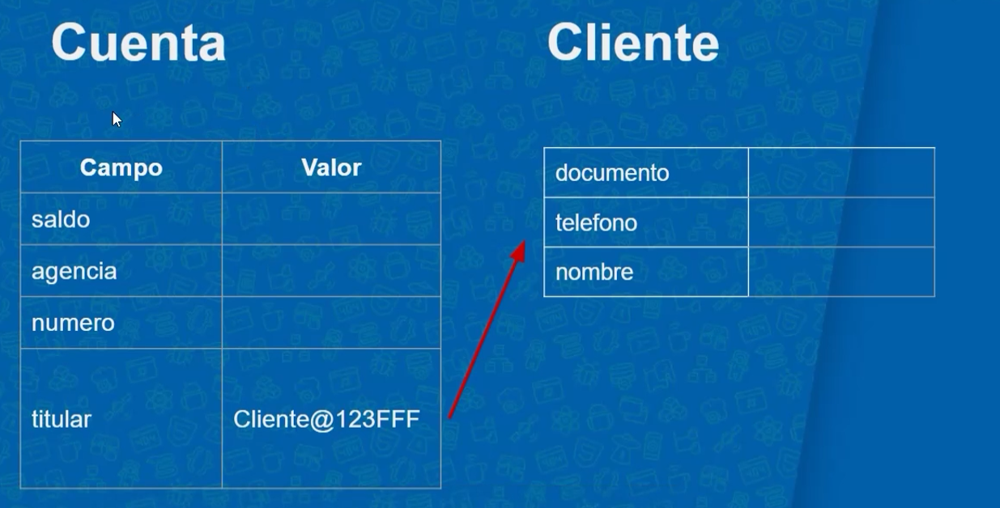

# Java OO: Entendiendo la Orientación a Objetos

## Temas del cusro 
- Domine el paradigma de programación más usado en el mercado.
- Entienda lo que son referencias y objetos
- Use atributos, métodos de la instancia y de la clase
- Aprenda a definir objetos a través de constructores
- Aprenda sobre encapsulamiento
<br>
## Introducin
En este curso se trabaja la orientacion a objectos en donde entederemos el conceptos de librerias y que son los objectos en Java la idea central del paradigma de Orientación de objetos es de que Los datos y la funcionalidad de una entidad van de la mano.
<br>

## Definicion de un objecto

Un objecto es la representacion del conjunto de atributos que compone alguna entidad o cosa de la vida que se intenta plasmar en la programacion. para hacer esto en el curso se hara un proyecto el cual es la creacion de un banco que este va a tener objectos en donde definiremos las caracteristicas que va tener la cuenta 


## Crear una clase

Primero debemos crear una clase con la palabra reservada de Clas la cual va ser la entidad que va guardar los valores de cuenta como se puede ver el ejemplo:

    //entidad cuenta:
    class Cuenta {

        double saldo; 
        int agencia;
        int numero;
        String titular;
    }   

Para crear una instancia, es obligatorio completar los valores de todos los atributos.

## Instancias

Una instacia es la representacion de un objecto siendo en si un objecto en particular que tiene su propia informacion y es unica, para creacion de una instacia se hace de la siguiente forma:


    public static void main(String[] args) { 
        Cuenta primeraCuenta =  new Cuenta(); //Antes de llamar a la cuenta toca especificar que tipo de variable es en este caso la variable es de tipo cuenta
        primeraCuenta.saldo = 1000; //llamamos el objecto y con el . determinamos el campo que va trabajar y le asignamos un saldo de 1000
        System.out.println(primeraCuenta.saldo); //para ver que si se guardo escribomos el objecto junto al campo
    }

    new //Es una palabra reservada lo que hace es decir crea esto nuevo en este caso la instacia Cuenta con (), tambien lo que hace es crear un espacio reservado en la memoria de java


**Valores por default**

Los valores por default en los objectos son los valores que tienen por defecto los campo de un objecto casi siempre es 0 o null tambien se da este valor porque llamamos a la instacia de un objecto y este inicializa los campos, tambien podemos determinar el valor por defecto como se puede ver:

    class Cuenta {

    double saldo = 100; 
    int agencia = 1;
    int numero = 02;
    String titular = "yo";

    }

**Referencias**

La referencia es el lugar de la memoria donde se guarda el objecto los datos de un obejcto si 2 objectos tienen la misma referencia del lugar de memoria tanto el primer objecto afectaran al otro y viseversa con la misma refencia osea cuando apunta al mismo objecto estas se suman los valores

        public static void main(String[] args) {
        Cuenta primeraCuenta = new Cuenta();
        primeraCuenta.saldo = 300;

        System.out.println("saldo de primera cuenta : " + primeraCuenta.saldo);

        Cuenta segundaCuenta = primeraCuenta;

        System.out.println("saldo de segunda Cuenta: " + segundaCuenta.saldo);

        segundaCuenta.saldo += 100;
        System.out.println("saldo de segunda Cuenta " + segundaCuenta.saldo);

        System.out.println(primeraCuenta.saldo);

        if(primeraCuenta == segundaCuenta) {
            System.out.println("Es la misma cuenta");
        }else{
            System.out.println("Es diferente");
        }


        System.out.println(primeraCuenta);
        System.out.println(segundaCuenta);
        }
    


## Creacion metodo sin retorno

Un metodo es un corportamiento que queramos que tenga nuestro objecto y esos los paso que debe tener nuestro objecto un metodo para que funcione nesecita parametros que el inpot que hara debtro de ()


    class Cuenta {

    double saldo; 
    int agencia;
    int numero;
    String titular;
    void depositar (double valor){
        saldo = saldo + valor;
    } //Este el ejempplo de un metodo que no regrese valor 
    }

void //Es una palabra reservada para decir que algo no retorne valor puede ejecutarse sin que retorne algo 

[Pruebas metodos](./src/PruebasMetodos.java) 

- **¿Cuál es la sintaxis y el orden correctos para llamar a un método con Java?**

    nombreDeReferencia.nombreDelMetodo();

- **Uso de this**
Usar la palabra reservada de this forma parte de buenas practicas lo que hace es decir que hace referencia a este objecto 

    class Cuenta {
    double saldo; 
    int agencia;
    int numero;
    String titular;
    void depositar (double valor){
        // Esta cuenta           // Esta cuenta
        //this account           //this account 
        //this object            //this object
        this.saldo             =      this.saldo                + valor;
        }    
    }

## Creacion metodo con retorno

Un metodo con retorno de valor hace lo opuesto a uno que no retorne este si nesecita una validacion para que este aprobado sino no se pasara la validacion como se mira 

    //No retorna valor 
    public void depositar (double valor){
        saldo = saldo + valor;
    }

    //Retornar valor 
    public boolean retirar(double valor) { //el tipo es booleano para la validacion 
        if(this.saldo >= saldo){
            this.saldo = this.saldo - valor; //la validacion del retiro 
            return true; //si pasa la validacion pasa true lo cual la finaliza
        } else{
            return false; //si no entonces no pasa 
        }
        
    }

## Referenciando de objectos

Ahora escriba el método de transfiere, también debe retornar un booleano, pero ahora recibirá una Cuenta que será el destino y la cantidad que se transferirá.

    public boolean transfiere(double valor, Cuenta destino){

    if(this.saldo >= valor){
        this.saldo -= valor;
        destino.deposita(valor);    
        return true;
    }
    return false;
    }

## Lo que se aprendio en definicion de comportamiento 

Cómo definir métodos con parámetros y retorno cómo devolver algo usando la palabra clave return cómo usar la referencia thispara acceder a un atributo que podemos pasar una referencia como parámetro de método los métodos se invocan desde la referencia utilizando el operador .

Si aún tiene dudas sobre las referencias, this y el uso de métodos, tenga la seguridad de que en las próximas clases (y cursos) revisaremos los conceptos y practicaremos mucho más.
<br>
<br>

# Composicion de Objectos

## Referencia objetos
En esta parte del curso vamos a ver la opcion de que podamos insertar mas datos a nuestro objecto de Cuenta entoces para esto se va a crear la referencia a un objecto con suspropios datos.

    class Cuenta {

    double saldo; 
    int agencia;
    int numero;
    Cliente titular; //Objecto referenciado
    }

Estamos separandon los datos del objecto cuenta en uno nuevo llamado cliente 


Este es el objecto cliente 

    public class Cliente {
    String nombre;
    String documento;
    String telefono;
    }

Luego de eso seguimos haciendo la referencia al objeto cliente en el de cuenta de la siguiente forma 

    class Cuenta {

    double saldo; 
    int agencia;
    int numero;
    Cliente titular; //Objecto referenciado
    }

Por ultimo para hacer la refencia de cliente en cuenta para insertale datos lo hacemos de la siguiente forma en el link

[TestReferencia2](/008_Java_OO/src/TestReferencia2.java)

Para entender mejor como funcionan las referencias estas lo que haces es que cuando nombramos un objeto dentro de otro lo que se esta haciendo es hacer referencia al objecto como se ve en la imagen




## Lo que se aprendio en el capitulo 04

• Darse cuenta de la relación entre clases a través de la composición;

• Ventajas de aislar información repetida en otra clase;

• Detalles de la composición;

• NullPointerException para atributos no inicializados y su cuidado.

# Encapsulamiento y Visibilidad  05

Seguimos con la contrucion de un sistema bancario

## Encapsulamiento

Cuando ejecutamos este codigo y se puede ver cuando queremos consurtar el saldo de la cuenta nos sale un -100 para evitar esto exixte un proceso en java que se llama Encapsulamiento para enteder esto se usa el ejemplo de un motor de un carro que  lo que hace este estar apartado del resto del vehiculo 

    public class PruebaAcceso { //la palabra public lo que quiere decir que es un modificador 

    public static void main(String[] args) {
        Cuenta cuenta = new Cuenta();

        cuenta.saldo = 200;
        cuenta.retirar(300);
        cuenta.saldo = cuenta.saldo - 300;

        System.out.println(cuenta.saldo);
        }

    }

### Modificadores 

Existen 2 tipos de modificadores se acceso los caules son:

    public //Es la palabra reserva que hace que tengas acceso desde cualquier lugar

    private //Es la palabra reserva que hace que mo tengas acceso desde cualquier lugar


## Getter

 forma parte de una buena practica en Java lo cual nos ayuda a identificar que clase se metodo estamos haciendo como ejemplo:

    public double getSaldo(){
        return this.saldo;       
    }

ahi identificamos el tipo de metodo que estamos haciendo con el nombre get que es uno de tipo consulta 

## Setter

Son las propiedades de acceso o accessors. Son, en esencia, funciones que se ejecutan para obtener (“get”) y asignar (“set”) un valor, pero que para un código externo se ven como propiedades normales el setter se usa para asignar valor de la siguiente forma 

    public void setTitular(String titular){
    this.titular = titular;
    }


# Ejemplo de getters y setters 

    Pero el uso de esta práctica no siempre es el más adecuado y expresa la realidad. Tenga en cuenta la clase Cuenta   representada a continuación que usa solo getter y setters como métodos:

        class Cuenta{
        private String titular;
        private double saldo;

        public void setTitular(String titular){
            this.titular = titular;
        }

        public String getTitular(){
            return titular;
        }

        public void setSaldo(double saldo){
            this.saldo = saldo;
        }

        public double getSaldo(){
            return saldo;
        }

        }

    Continuamos usando atributos privados y nuestro modelo parece seguir perfectamente la propuesta de encapsulación donde la   clase misma administra sus estados (atributos). Un uso clásico de esa cuenta nos llevaría al siguiente escenario:

        Cuenta cuenta = new Cuenta();
        cuenta.setTitular("Fábio")
        cuenta.setSaldo(100.0);

    Todo parece perfecto, ahora imagina que necesitas retirar 50.0 de esa cuenta. Esta operación requerirá que el saldo sea     suficiente. Una simple verificación de la siguiente manera aseguraría que el saldo no haya sido negativo. En nuestro    ejemplo no hay límite más allá del saldo :)

        Cuenta cuenta = new Cuenta ();
    cuenta.setTitular("Fábio")
    cuenta.setSaldo(100.0);

    double valorSaque = 50.0

    if(cuenta.getSaldo() >= valorSaque){
        double nuevoSaldo = cuenta.getSaldo() - valorSaque;
        cuenta.setSaldo(nuevoSaldo)
    }
     ```

    ¡Funcionó! Pero un problema es que esta lógica de restringir el retiro al monto del saldo deberá rehacerse cada vez que     se necesite una operación de retiro en nuestra cuenta. Además del problema de duplicación de esta sección, un problema  para la encapsulación es que quien realmente controla las reglas de saldo de la cuenta es quién está usando la cuenta. En    otras palabras, nada impide que alguien implemente un límite adicional para esto y tenga una regla completamente   diferente de otros objetos de tipo Cuenta:

        ```
        Cuenta conta = new Cuenta ();
        cuenta.setTitular("Fábio");
        cuenta.setSaldo(100.0);

        double valorSaque = 50.0;

        if(cuenta.getSaldo() + 1000.0 >= valorSaque){
            double nuevoSaldo = conta.getSaldo() - valorSaque;
            cuenta.setSaldo(nuevoSaldo)
        }
        ```

    Cuando creamos clases que se limitan a tener atributos privados con setters y getters, generalmente decimos queson      clases que solo cargan valor, por lo que comúnmente se llaman clases de títeres o `Value Objects`.
    ¡Una clase de títeres es una que no tiene responsabilidad, aparte de llevar un puñado de atributos!     ¡Estodefinitivamente   no está orientado a objetos! Este modelo, aunque a veces se usa, no debería ser una práctica     comúnal desarrollar el  dominio de nuestro proyecto con el riesgo de caer en el `modelo anémico`, que es exactamente    loque la `Cuenta` es hoy.  Una clase donde los datos y los comportamientos / lógica no están juntos.
    Volviendo a nuestro ejemplo de la Cuenta, está claro que en el mundo real las operaciones podrían representarse con     métodos como `saca()` y `deposita()` en lugar de simplemente establecer `SetSaldo()`:

        public void setTitular(String titular){
        this.titular = titular;
        }

        public String getTitular(){
            return titular;
        }

        public void saca(double valor){
            if(valor > 0 && saldo >= valor){
                saldo -= valor;
            }
        }

        public void deposita(double valor){
            if(valor>0){
                saldo += valor;
            }
        }

        public double getSaldo(){
            return saldo;
        }

    Cuenta cuenta = new Cuenta(); cuenta.setTitular("Fábio"); cuenta.deposita(100.0);

    double valorSaque = 50.0; cuenta.saca(valorSaque);

    `

    ¿Mucho mejor no es así? No hay duplicaciones de código, y mucho menos otras clases que controlan el estado de nuestra   cuenta como lo hicimos anteriormente.

    Conclusión Los setters y getters deben usarse con precaución y no todos los atributos privados necesitan exponer estos  dos métodos en riesgo de caer en un modelo anémico que tiene sus comportamientos controlados por otras clases.


### Aprendimos en esta clase 05:

Atributos privados, restringiendo el acceso a los atributos. Encapsulación de código Métodos de lectura de atributos, los getters Métodos para modificar atributos, los setters Getters y Setters de referencia

# Constructores y mienbros estaticos 06

## Constructores

Los constructores dehinen los parametros de los objectos antes de que sean llamados para iniciar atributos y se crea dentro de la clase del objecto y se escribe asi 

        public Cuenta(int agencia) { //Este metodo nos retorna el objecto cuenta lo que nos permite manipular el objceto antes de su nacimiento esto se le llama constructor//
        //System.out.println("Aqui se crea una cuenta");
        
        if(agencia<= 0){
            System.out.println("No se permite 0");
            this.agencia = 1;
        }else{
            this.agencia = agencia;
        }
        total++;

        System.out.println("Se va creando: " + total + " cuentas");
        }

Los constructores se utilizan para inicializar los atributos.

## Variables estaticas

Las variables estaticas nos ayudan para tener un valor unico cuando queramos tener datos estaticos lo que nos dice esta variable es que no va a ser de la instancia sino de la clase y se compone ais 

    private static int total = 0;

En este capítulo, nuestro aprendizaje se centró en los constructores. Están diseñados para que los objetos tengan sus atributos inicializados en la construcción misma. Esta estrategia evita estados inconsistentes en nuestro objeto.

## Aprendimos en esta clase 06

Los constructor de clases, que permite recibir argumentos e inicializar atributos desde la creación de un objeto. Con esto, la inicialización de los atributos recibidos en el constructor se vuelve obligatoria. Atributos de clase, atributos estáticos. Métodos de clase, métodos estáticos. Ausencia de referencia, del this, dentro de los métodos estáticos.

## Fin del curso de Java OO: Entendiendo la Orientación a Objetos


# POO: ¿Qué es la programación orientada a objetos?

-[POO: ¿Qué es la programación orientada a objetos?](https://www.aluracursos.com/blog/poo-que-es-la-programacion-orientada-a-objetos)