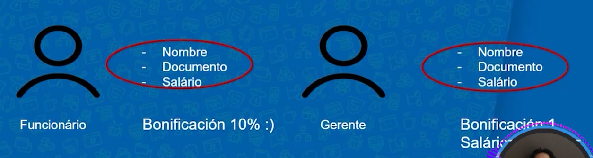
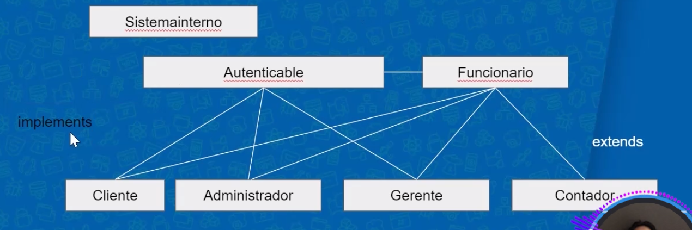

# Java Polimorfismo: Entendiendo herencia e interfaces

## Introduccion 

En este curso se veran lo que son la herancias entre los objetos tambien como utilizar el polimerfismo en un objecto como base para crear otros objetos de diferente tipo y utilizar interfaces en el codigo.

## Revisión del proyecto Byte Bank

Resiramemos el proyecto del bytebank en el resto del curso descargando el proyecto de git 

# Nuevo proyecto 

En este nuevo proyecto de bytebank vamos a crear un nuevo proyecto  llamado bytebank-heredado que este vamos crear una clase de funcionario el cual va a tener sus gettetrs y setters con un constructor sin parametro 

    public class Funcionario {

    private String nombre;
    private String documento;
    private String salario;

    public Funcionario(){

    }

    public String getNombre() {
        return nombre;
    }

    public void setNombre(String nombre) {
        this.nombre = nombre;
    }

    public String getDocumento() {
        return documento;
    }

    public void setDocumento(String documento) {
        this.documento = documento;
    }

    public String getSalario() {
        return salario;
    }

    public void setSalario(String salario) {
        this.salario = salario;
    }

    }

## Herencia 

Las herencias los que nos ayudan es crear clases que tienen atributos muy parecidos pero con distinto nombre esto nos ayuda recortar codigo y no repetirlo como se puede ver de ejemplo crearemos una clase gerente que tendra esos atributos.

como se puede ver estamos creando una clase repetida de funcionario pero con el nombre de gerente entonces para obtimizar el codigo mejot en vez de crear una clase gerente con los mismo atributos de funcionario crearemos una herencia de funcionario para crear un gerente.

Entonces agregaremos un nuevo atributo en la clase funcionario que va ser tipo si es 0 es funcionario si es 1 es gerente

    private String nombre;
    private String documento;
    private double salario;
    private int tipo;

Despues le hacemos sus getters y setters a tipo y hacemos la herencia en el metodo getbonificacion especificando lo siguiente 

    public double getBonificacion(){ //Esto identifica que tipo de funcionario es que recibe la bonificacion
        // si tipo es = 1 es un gerente
        // si tipo es = 0 es un funcionario
        if (tipo == 1) {
            return this.salario;
        }else if(tipo == 0){
            return this.salario * 0.1;
        } else{
            return 0;
        }
    }

Esto seria un ejemplo de herencia

## Comenzando con la herencia

Ahora intentaremos meternos mas al tema de herencia en donde crearemos herencias especifias de una clase algo importante del codigo es que el codigo se adapte a tu entorno no tu al codigo para esto tomaremos las clases que creamos 

como se puede ver esas 2 clases tienen en comun que tiene los mismos atributos esto siginifiaca que som un trabajador del banco para decir esto en java se usa la palabra reservada de "extends" esto se aplica de la siguiente forma 

    public class Gerente extends Funcionario { //Estamos diciendo que la clase gerente es una extencion de funcionario con extends
    
    }

con esto la clase gerente tiene tidos los atributos de funcionario es una herencia porque decimos que gerente es un funcionario asi seria la comparacion que a gerente se le pueden agregar metodos que funcionario no tiene

Asi se veria la comparacion del diagrama de las clases

Seguimos en la clase gerente y agregamos un nuevo atributo de clave con su setters validando seguido de un metodo de inicio de iniciarSesion que valida si la clave es correcta regresa true sino es false 

    public class Gerente extends Funcionario {
 
    private String clave;

    public void setClave(String clave) {
        this.clave = clave;
    }

    public boolean iniciarSesion(String clave){
        return clave == "12345";
    }

    }

Asi quedaria el codigo de test gerente [ejemplo](/009_Java_Polimorfismo/bytebank-heredado/src/TestGerente.java) validando el inicio de sesion 

## Metodo super

Es una palabra reservada para decir que llama metodos de la clase pabre o clase suporior y es asi 

    //Sobre-escritura de metodo 
    public double getbonificacion(){
        return super.getSalario(); //metodo de la clase superior llamado
    };

# This y super

# Sobre-escritura de metodos

la sobre escritura es cuando usas la misma firma de un metodo pero lo estas repitiendo en otra clase este consecto tambien se pueden usar en otros lenguajes de programacion para desmotrar un ejemplo seria asi:

    public double getbonificacion(){
        return super.getSalario()+ super.getbonificacion(); // se esta sobre escribiendo sobre el metodo getbonificacion() que es de la clase madre si esta es camniada se vera reflejada en la sobre escritura 
    };

Vimos que la sobreescritura es un concepto importante de la herencia, porque permite redefinir un comportamiento previsto en la clase madre a través de la clase hija. 

##  el orden correcto de los modificadores de visibilidad, de menor a mayor visibilidad

private < protected < public

**Modificadores de acceso**

Los modificadores de acceso o accesibilidad son algunas palabras claves utilizadas en el lenguaje Java para definir el nivel de accesibilidad que los elementos de una clase (atributos y métodos) e incluso la propia clase puede tener los mismos elementos de otra clase.

***Public***

Este es el modificador menos restrictivo de todos. De esta manera, cualquier componente puede acceder a los miembros de la clase, las clases y las interfaces.

***Protected***

Al usar este modificador de acceso, los miembros de la clase y las clases son accesibles para otros elementos siempre que estén dentro del mismo package o, si pertenecen a otros packages, siempre que tengan una relación extendida (herencia), es decir, las clases secundarias pueden acceder a los miembros de su clase principal (o clase de abuelos, etc.).

***Private***

Este es el modificador de acceso más restrictivo de todos. Solo se puede acceder a los miembros definidos como privados desde dentro de la clase y desde ningún otro lugar, independientemente del paquete o la herencia.

## Introducción a polimorfismo

Vamos a pronfundar en el concepto de herencia que tiene 2 pilares que son la reutilizacion del codigo, junto al polimorfismo, en java todo se basa en referencias de las clases y metodos En el mundo orientado a objetos, el polimorfismo permite que Las referencias de tipos de clases más genéricos referencian objetos más específicos.

La aplicacion del polimorfismo es que nos permite crear una unica puerta de entrada para todos los elementos de una clase padre

EJEMPLO DE POLIMERFISMO

[TestControlBonificaciones](/009_Java_Polimorfismo/bytebank-heredado/src/TestControlBonificaciones.java)

lo que hacemos el copiar y pegar 2 clases de objecto cuenta y cliente que estos los vamos a implimenter en el bytebank-heredado luego de eso vamos a crear una nueva clase llamada "CuentaCorriente" de esta forma la escribimos

    public class CuentaCorriente extends Cuenta{

    public CuentaCorriente(int agencia, int numero) {
        super(agencia,numero); //lo que hacemos el llamar el constructor de la clase padre que son agencia y numero
        }
    }

lo que hacemos en el constructor de la clase es settiar los parametros del constructor padre.

## Sobre escritura de metodos 

lo que se hace la sobre llamar matodos de la clase pabre que solo afecta esta clase y deje el metodo pabre sin modificaciones es un metodo sobre escrito y no es metodo nuevo y es asi llamando al metodo retirar

    @Override
    public boolean retirar(double valor) {
        double comision = 0.2; //combrar comision mas el valor trasferido
        return super.retirar(valor+ comision);
    }

la firma del metodo debe ser igual al pabre para que compile

**En la última clase vimos sobre la anotación @Override. ¿Cuál es su propósito?**

Se utiliza para sobrescribir el método de la clase madre, lo que indica que se ha modificado el método original.

## Clase abstracta

La abstracion de clases es llevar esto de la abstracta del mundo real a la programacion para definir una clase abstracta se puede tomar la clase por defecto de funcionario y lo veremos como abstracta de esta forma

    public abstract class Funcionario 

No se pueden ser instanciadas. Para crear una instancia, primero debemos crear una clase hija no abstracta,  Una clase abstracta representa un concepto, algo abstracto, y el compilador no permite instanciar un objeto de esa clase. Para crear una instancia, es necesario crear primero una clase hija no abstracta.

## Metodo abstracto

un método abstracto es un tipo especial de método que no tiene una implementación definida en la clase en la que se declara, sino que se deja para que las clases derivadas o subclases lo implementen. Un método abstracto se declara utilizando la palabra clave abstract.

Los métodos abstractos son útiles cuando se desea definir un comportamiento general en una clase base, pero se deja la implementación específica a las subclases. Esto permite la creación de una jerarquía de clases que pueden proporcionar diferentes implementaciones de los métodos abstractos según sus necesidades.

    public abstract void depositar(double valor);

[Interfaces](https://docs.oracle.com/javase/tutorial/java/IandI/createinterface.html)

[Clases abstracta](https://docs.oracle.com/javase/tutorial/java/IandI/abstract.html)

## Estructura de bytebank 

La estructura de bytebank a cambiando porque ahora algunos funcionarios de la empresa deben pasar primero por un metodo de [FuncionarioAutenticable](/009_Java_Polimorfismo/bytebank-heredado/src/Autenticable.java) para validar su ingreso de esta forma esta estructurado 

## Interfaces

Las interfaces conptualmente se puede definir una clase pero de tipo asbtracta se parece mucho solo inteface no puede tener metodos implementados la palabre reservada es interface y param llamar una interfaces se pone la palabra reservada implemes en la clase que queramos implementar la interfas, la interfas solo tienen la firman del metodo

**interface Ejemplo**

    public interface Autenticable { //interfas que no puede contener metodos solo el cuerpo

    public abstract void setContraseña(String contraseña);

    public abstract boolean inicalizarSeccion(String contraseña);

    }

Asi queda el sistema del bancon con las interfas, esto como se observa el en diagrama esto puede ser esclable

Toca indertificar los grupos en donde se ubican los objectos con su respectiva relacion Con composiciones e interfaces tendremos más flexibilidad con nuestro código, ya que no estaremos apegados al acoplamiento que propone la herencia.

## Composición objetos
La composicion final del banco bytebank identificando las distintas clases con sus nombres con sus resoectivas abstractaciones 

## Lo que aprendimos en el curso 

En el  curso de Java sobre polimorfismo abordó conceptos como herencia, interfaces, composición de objetos y el uso de superclases y subclases. También se explicaron conceptos relacionados con la sobreescritura de métodos, modificadores de acceso y la utilización de clases abstractas.

En este curso empezamos por una clase principal la de funcionario la cual fue escanlando en las distintas funciones que puede tener este.

# Fin del curso de Java Polimorfismo: Entendiendo herencia e interfaces

