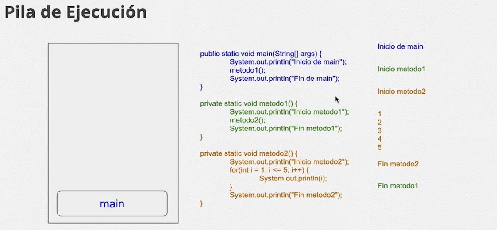
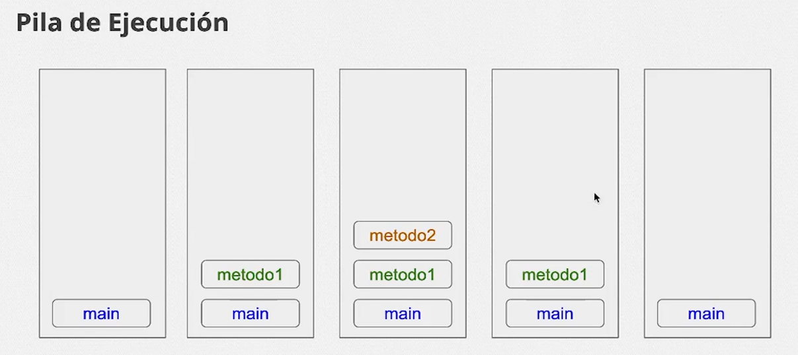
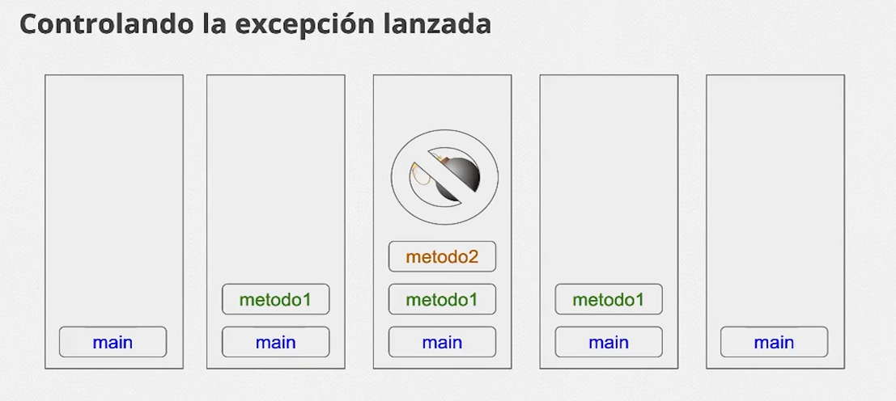

# Java Excepciones: Aprenda a crear, lanzar y controlar excepciones

## Introduccion

En el curso se veran lo que es el manejo de errores porque siempre ocurren errores en el codigo para manejar esto en curso manejaremos lo que son las excepciones de resultados esperados y inesperados.

Se tomara el proyecto de la clase anterior de proyecto de [bytebank](./java-herencia-polimorfismo/src/bytebank)

## Pila de ejecucion 

Pila de ejecución podemos hacer referencia que es el lugar en la memoria, digamos donde tienen lugar todos los eventos que Java va ejecutando

-[Pila de ejecucion ejemplo](./Java-pila-ejecucion/src/Flujo.java)

-[Documentacion](https://docs.oracle.com/en/java/javase/19/docs/api/java.base/java/lang/Exception.html)

## Pila de ejecucion-Grafico

Para entender mejor como funciona la pila de ejecucion del codigo se muestra asi la funcionalidad, la pila son un conjunto de cosas apiladas

como se observa la ejecucion va en una pila donde empieza primero el main que llama a la funcion de metodo1 que a su vez llama a metodo 2 y cuando termanan estas funciones inprime fin de main

Para enterder mejor toma la pila como una pila de platos que primero debes liberar lo de arriba para liberar lo de abajo

asi se visualizaria como se estaria funcionando las pila de los metodo que primero debe liberar lo de arriba para mover lo de abajo.

## Debug

El debug es la ejecucion del sistema y cuando encuentra un breakpoint este va a parar esto lo haremos en Vs Code 

se hace cuando se selecciona la opcion debug en nuestro codigo y marcamos el breakpoint para visualizar el recorrido del codigo 

# Tratamiento de excepciones 

## Erorres

un error en codigo es un suceso que impide que este complete su ejecucion, los errores en java se caracterizan por nombres que se pueden buscar para solucionar este error 

## Exepciones

El manejo de exepciones nos ayua a gestiomar los errores en el codigo no exite el codigo perfecto para detectar exepciones toca leer bien el mensaje del error detectando sus partes 

### Controlando errores

En el codigo colocamos un error aproposito en la funcion de metodo2 que generara un error en el codigo

para dectectar este error y hacer que el codigo compile usaremos 2 palabras reservadas de Java que son para atrapar el error 

    try{ // lo que hace es intentar hacer el error 

    } catch(){ //catch atrapa el error //en los () se especifica que error va a atrapar
    //en las {} insertamos que queremos que ejecute puede ser un print del error 
    }

asi quedaria el codigo con la implementacion de la expecion ojo que no puede existir un try sin un cath y visebersa

    public static void metodo2(){
    System.out.println("Inicio metodo2");
    for(int i =1; i<= 5; i++){
      System.out.println(i);
      try { //El try 
        int num = 0;
        int resultado = i/num;
        System.out.println(resultado);
      } catch (ArithmeticException exception) { //catch //en el cath se pueden espeficar varios errores que se pueden capturar con | y controlar varias expeciones 
        System.out.println(exception);       
      }
    }
    System.out.println("Fin metodo2");
  }

*** Muestra grafica ***

Lo que hace el try es capturar el error y dejar que codigo compile normal

Toda excepción en Java tiene un nombre que la idenfica. Este enfoque hace que sea más fácil de entender que usar números mágicos (códigos de error) como 15, 7012 o 16.
